# Paint & Sip with your friends
## A blog about painting and making artsy friends

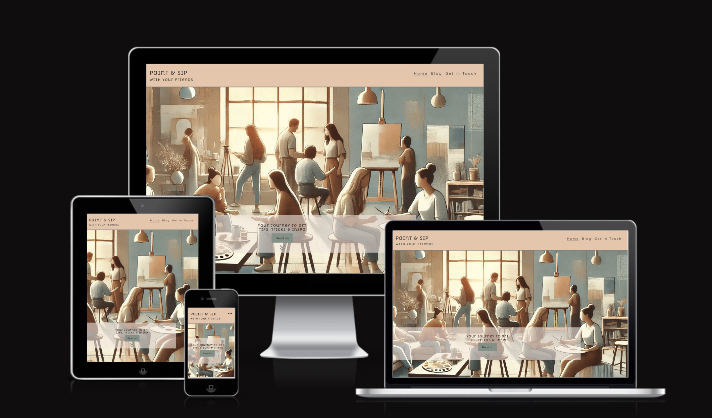

[Preview the website by clicking here](https://nathiedeheyl.github.io/paint-and-sip-friends)

## Table of contents 

1. [General](https://github.com/nathiedeheyl/paint-and-sip-friends/blob/main/README.md#general)
    - [Project description](https://github.com/nathiedeheyl/paint-and-sip-friends/blob/main/README.md#project-description)  
    - [Purpose of the project](https://github.com/nathiedeheyl/paint-and-sip-friends/blob/main/README.md#purpose-of-the-project)
2. [UX](https://github.com/nathiedeheyl/paint-and-sip-friends/blob/main/README.md#ux)
    - [User demographic](https://github.com/nathiedeheyl/paint-and-sip-friends/blob/main/README.md#user-demographic-or-who-will-generally-be-using-the-website)
    - [General User goals](https://github.com/nathiedeheyl/paint-and-sip-friends/blob/main/README.md#general-user-goals)
    - [General User expectations](https://github.com/nathiedeheyl/paint-and-sip-friends/blob/main/README.md#general-user-expectations-or-what-do-the-target-users-need-from-the-website)
    - [User stories](https://github.com/nathiedeheyl/paint-and-sip-friends/blob/main/README.md#user-stories)
        - [User Groups](https://github.com/nathiedeheyl/paint-and-sip-friends/blob/main/README.md#user-groups)
        - [For the User](https://github.com/nathiedeheyl/paint-and-sip-friends/blob/main/README.md#for-the-user)
        - [For the Site owner](https://github.com/nathiedeheyl/paint-and-sip-friends/blob/main/README.md#as-the-site-owner)
3. [Design](https://github.com/nathiedeheyl/paint-and-sip-friends/blob/main/README.md#design)
    - [Fonts](https://github.com/nathiedeheyl/paint-and-sip-friends#fonts)
    - [Colors and Contrast](https://github.com/nathiedeheyl/paint-and-sip-friends#colors-and-contrast)
4. [Features](https://github.com/nathiedeheyl/paint-and-sip-friends/blob/main/README.md#features)
    - [Home page](https://github.com/nathiedeheyl/paint-and-sip-friends/blob/main/README.md#home-page)
    - [Blog page](https://github.com/nathiedeheyl/paint-and-sip-friends/blob/main/README.md#blog-page)
    - [Get in touch page](https://github.com/nathiedeheyl/paint-and-sip-friends/blob/main/README.md#get-in-touch-page)
5. [Possible future features](https://github.com/nathiedeheyl/paint-and-sip-friends/blob/main/README.md#possible-future-features)
6. [Languages](https://github.com/nathiedeheyl/paint-and-sip-friends/blob/main/README.md#languages)
7. [Technologies](https://github.com/nathiedeheyl/paint-and-sip-friends/blob/main/README.md#technologies)
8. [Testing](https://github.com/nathiedeheyl/paint-and-sip-friends/blob/main/README.md#testing)
    - [Manual testing checklist](https://github.com/nathiedeheyl/paint-and-sip-friends/blob/main/README.md#manual-testing-checklist)
    - [Bugs](https://github.com/nathiedeheyl/paint-and-sip-friends/blob/main/README.md#bugs)
9. [Deployment](https://github.com/nathiedeheyl/paint-and-sip-friends/blob/main/README.md#deployment)
10. [Credits](https://github.com/nathiedeheyl/paint-and-sip-friends/blob/main/README.md#credits)
    - [Media](https://github.com/nathiedeheyl/paint-and-sip-friends/blob/main/README.md#media)
    - [Resources](https://github.com/nathiedeheyl/paint-and-sip-friends/blob/main/README.md#ressources)
11. [Changelog](https://github.com/nathiedeheyl/paint-and-sip-friends/blob/main/README.md#changelog)
    - [Version 1.0.0 (Initial)](https://github.com/nathiedeheyl/paint-and-sip-friends/blob/main/README.md#version-100-initial)


## General

### Project description

'Paint & Sip with your friends' is a platform for art enthousiasts looking to explore painting while connecting with friends for like-minded people. The site offers practical advice for beginners on how to get started, which tools to aqquire and recommends some easy step by step tutorials to begin with. Additionally, the blog features a ficitional group of friends who organise different art related events, and users can find a contact form for inquiries or taking part in those events.

<details>
<summary>Wireframes</summary>

<details>
<summary>Wireframes for mobile devices</summary>

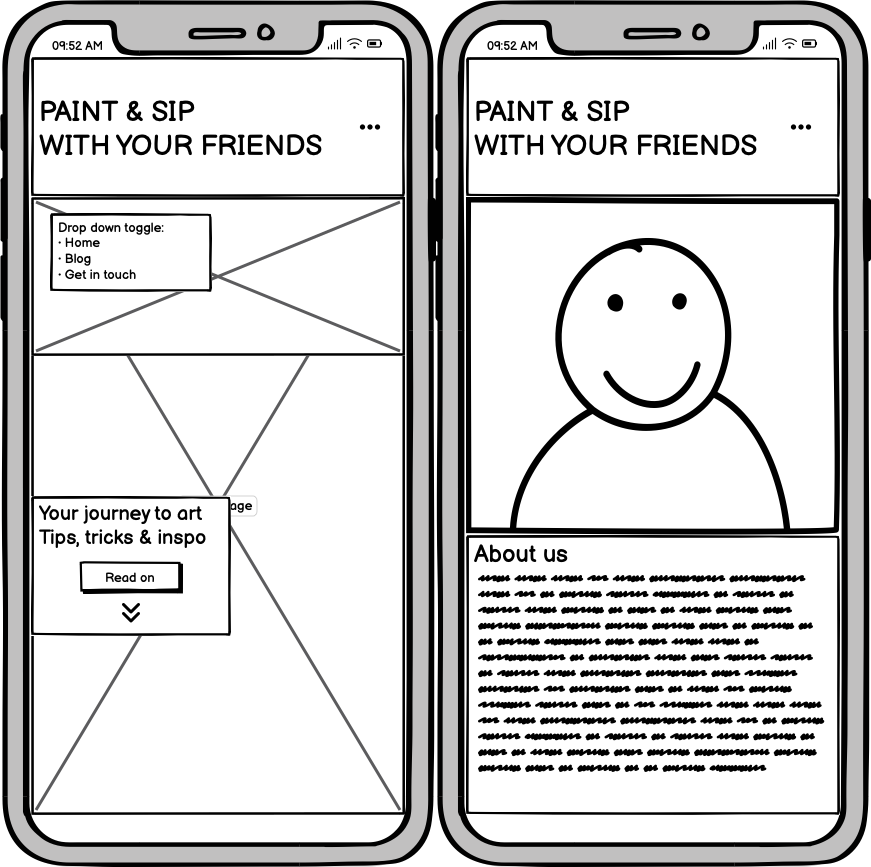

</details>
<details>
<summary>Wireframes for tablet devices</summary>

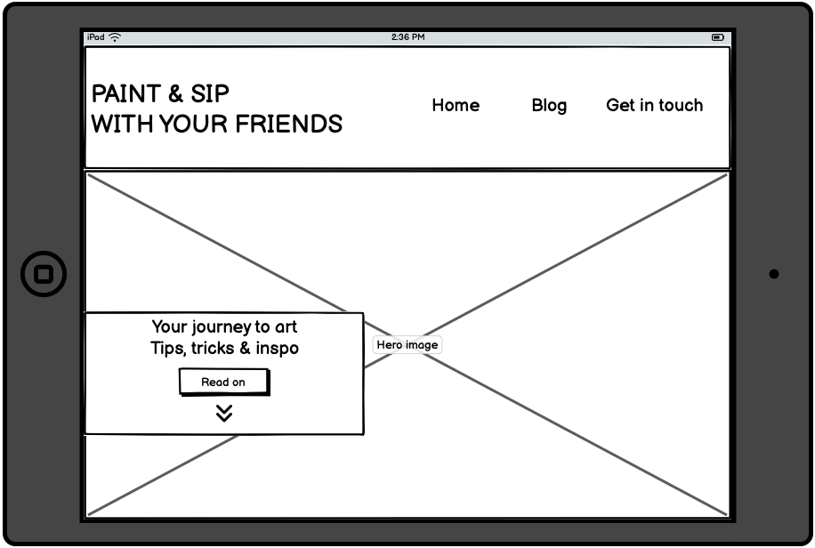

</details>
<details>
<summary>Wireframes for desktops</summary>

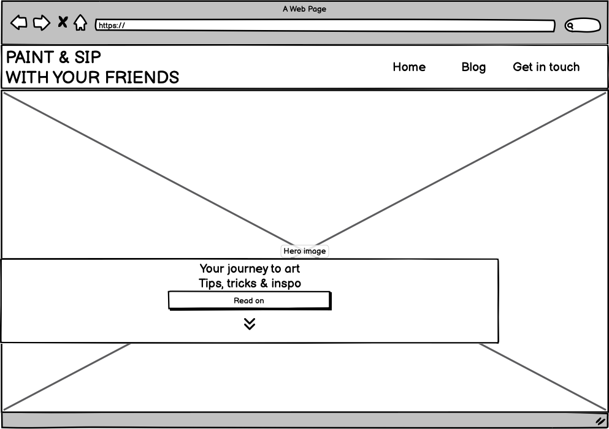

</details>
</details>

### Purpose of the project

The main goal is to inspire and engage users to start or continue painting as a hobby and connect with a community of art lovers through shared experiences. 

[Back to Table of Contents](https://github.com/nathiedeheyl/paint-and-sip-friends/blob/main/README.md#tabel-of-contents)

## UX 

### User demographic or: Who will generally be using the website? 

+ Target users: young to mid-aged art enthousiasts, hobbyists who are looking to meet new people, engage in creative activities, and share ideas in a casual, fun environment. 

### General User goals 

+ Learn the concept of a 'Paint & Sip' event.

+ Find ideas and ressources for organising their own events.

+ Read about painting techniques, tips, and past experiences from a art enclined community. 

+ Connect with the= site owner through the contact form to join a paint & sip night.  

### General User expectations or: What do the target users need from the website?  

+ Accessibel website on all devices (mobile, tablet, desktop). 

+ Responsive and intuitive design on all devices with consistent navigation. 

+ User-friendly interface with well-structured features. 

+ Clear, inspiring content to spark creativity. 

### User stories 

#### User Groups 

To effectively address the needs of my audtience, I have identified three key user groups: 

+ **Observers:** Casual browsers who stumble upon the website. They seek relatable content and easy action steps to ignite their creativity. The goal is to engage them with inspiring material that encourages return visits. 

+ **Virtuals:** Active users who engage with the content from a distance. They are looking for practical resources such as challenges, beginner tips, and motivational content that empowers them to start or continue painting and enhance their skills. They feel as a part of a supportive community. 

+ **Locals:** Individuals who live in the area and are interested in attending meetups. They are motivated to start painting by receiving easy action steps and are primarily focused on finding information about upcoming events. Additionally, they seek engaging content that fosters excitement about participating in friendly gatherings with fellow art enthusiasts.

#### For the User: 

+ _As an observer_, I want to feel encouraged to start painting as a creative hobby and feel confident about its use for my personal life. 
+ _As an observer_, I want to be inspired by relatable content so that I feel motivated to explore my own creativity.
+ _As an observer_, I want to discover easy action steps for starting my artistic journey so that I can begin painting without feeling overwhelmed.
+ _As a virtual_, I want to find challenges and beginner tips on how to paint at home so that I can improve my skills and enrich my personal life.
+ _As a virtual_, I want to access regularly updated content with creative ideas and motivational words about the benefits of painting, so I can keep my creativity flowing.
+ _As a local_, I want to learn about upcoming meetups so that I can join a friendly gathering of fellow art enthusiasts and make new friends.
+ _As a local_, I want to read authentic and lively content about past meetups so that I feel excited to participate and connect with others in my area.

#### As the Site owner:

+ I want to share blog posts and experiences from my paint and sip nights, so that I can inspire others to join or start their own events. 
+ I want to connect with like-minded people through this website, so I can grow a community of hobby artists. 
+ I want to encourage others to start painting without fear of judgment, so they can build confidence in their creative skills. 
+ I want to grow my website and eventually explore monetization opportunities, so I can potentially turn the website/project into a source of income. 

[Back to Table of Contents](https://github.com/nathiedeheyl/paint-and-sip-friends/blob/main/README.md#tabel-of-contents)

## Design 

### Fonts

Fonts were imported from: https://fonts.google.com/. As a heading font, _Delius Unicase_ brings an artistic, quirky allure, while _Quicksand_, a modern sans-serif font, is used for the body to ensure readability while maintaining a playful appearance. 

[Back to Table of Contents](https://github.com/nathiedeheyl/paint-and-sip-friends/blob/main/README.md#tabel-of-contents)

### Colors and Contrast 

+ **Primary colors:** The main colors the focus lies on are: #eac5a9 for the background of e. g. header and footer; and #393434 as body text color for it's soft contrast that fits the general pastel allure of the website. 

+ **Secondary colors:** The general background color of the website is #f5e5dc which fits the pastel vibe of the website and aligns the richer primary shades. </br>
To complement the primary colors and soft beige background color of the website, a soft, but dark green was chosen to create enough contrast in elements like the jump-btns without disturbing the aestetics: #f5e5dc. 

+ **Contrast:** To ensure enough contrast ratio was given, the Chrome dev tools were used mostly, as well as https://pagespeed.web.dev/. 

## Features 

### Home page 

+ A sticky header with toggle down menu for smaller devices appears on all pages. It opens by clicking the three dots icon on the right side of the header. On larger devices (from 768px), the #menu appears in a horizontal line, styled with flexbox. </br>
    <details>
    <summary>Screenshots of responsive header</summary>

    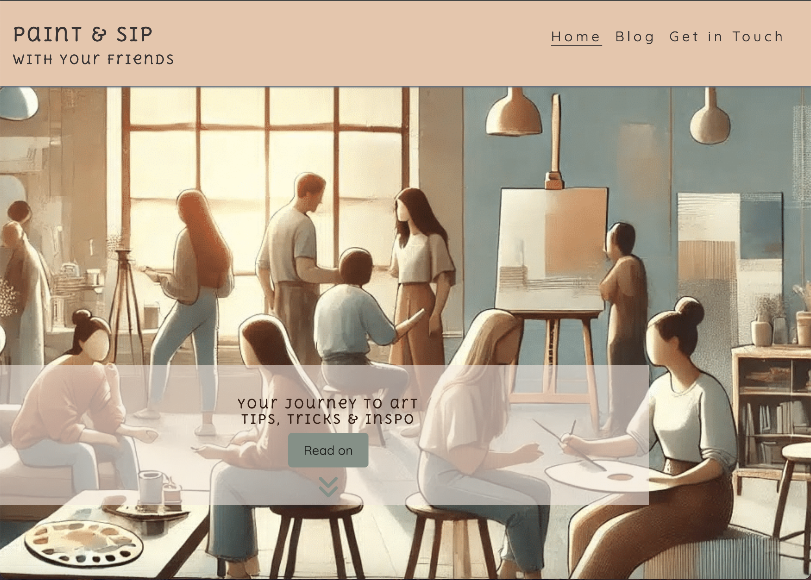</br>

    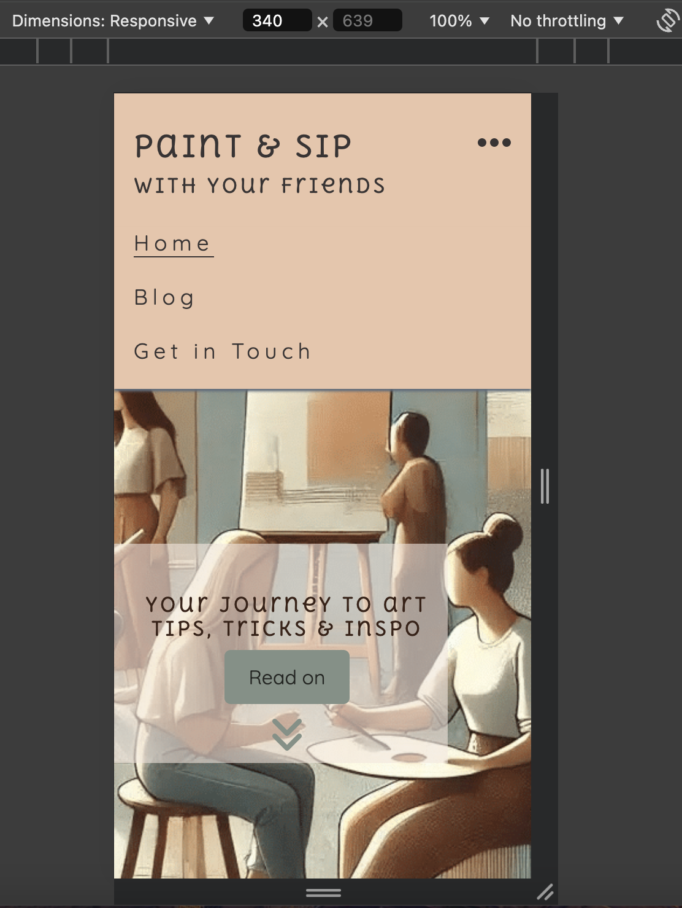
    </details></br>

+ A button of class="jump-btn" in the hero section guides mobile users to the next section (#about). The button is reused between the #about and #motivation sections, ensuring smooth navigation through the homepage content. 

    <details>
    <summary>Screenshots of jump-btn(s)</summary>

    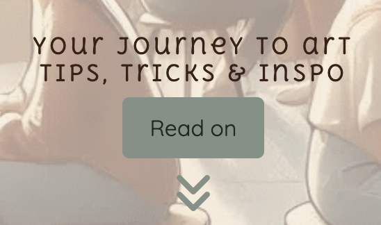</br>

    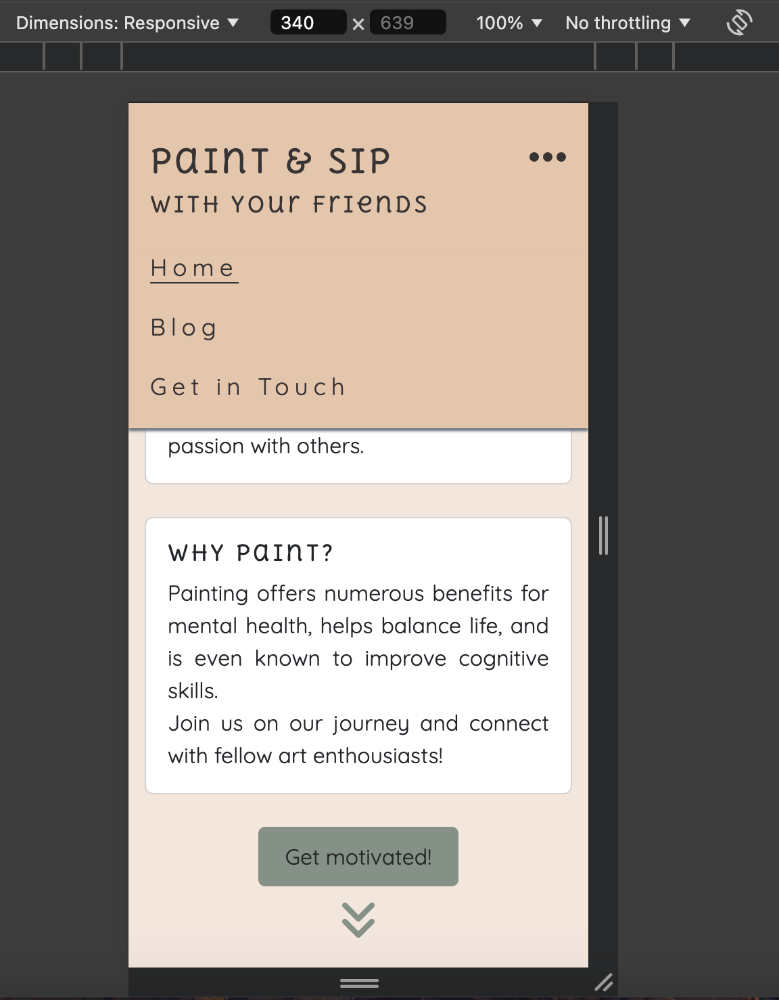
    </details></br>

+ In the #motivation and #link section, Bootstrap's colums system and cards create a responsive and visually appealing structure.

+ The two link cards in the #link section redirect to the Blog page and Get-in-touch pages, using buttons styled like the previous jump-btn.

    <details>
    <summary>Inside navigation through links (buttons)</summary>

    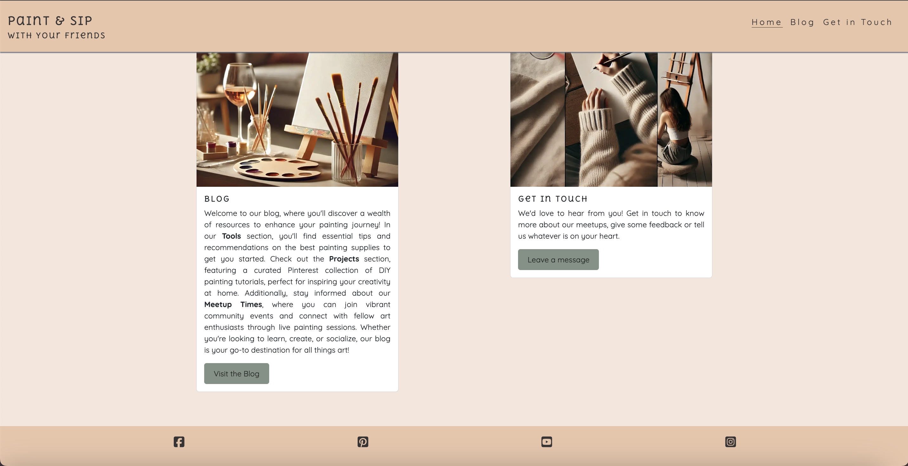</br>

    </details></br>

+ Font Awesome social media icons are in the footer. Pinterest replaces the commonly used Twitter/X icon, as it better fits the website's context.

    <details>
    <summary>Social media icons in Footer</summary>

    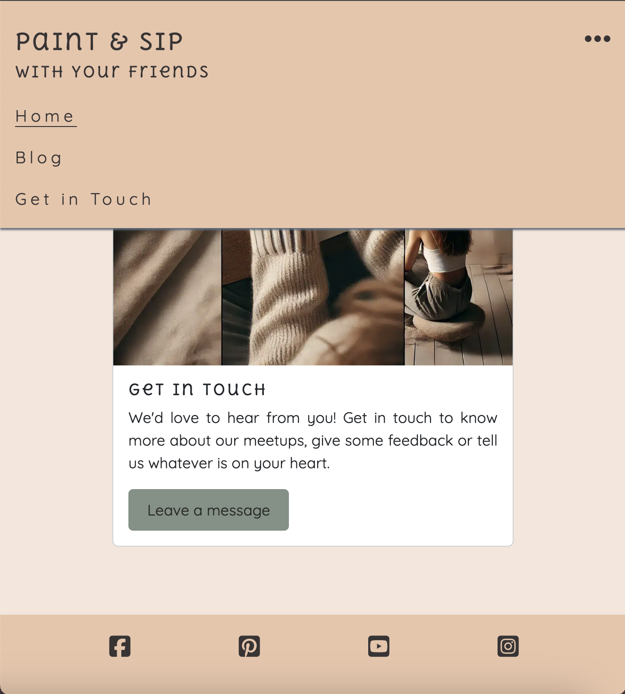</br>

    </details></br>

### Blog page

+ In addition to the sticky header, a fixed navigation bar was added for the blog page to help users navigate through different sections (Tools, Projects, Meetup times). These sections are expected to grow over time, justifying the extra navigation bar, which is styled slimmer for larger devices (from 768px). 

    <details>
    <summary>Additional navigation bar on Blog page</summary>

    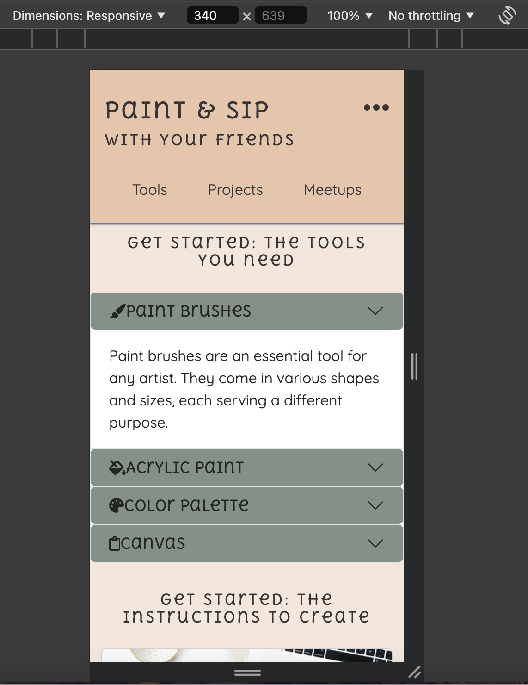</br>

    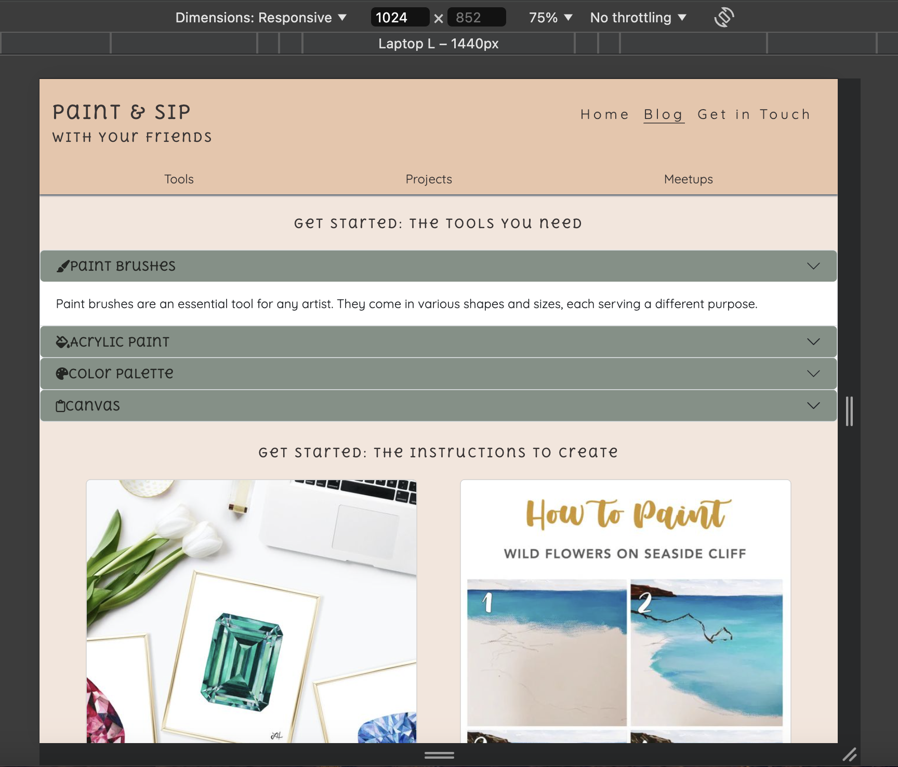
    </details></br>

+ A Bootstrap accordion organizes the #tools section, keeping the page uncluttered and focusing the user's attention on other content. 

    (see screenshot above for visual)

+ The #meetup section uses flexbox for a compact display on smaller devices. 

+ The #meetups section includes a call-to-action button guiding users to the contact form page. 

    <details>
    <summary>Flexbox styling of meetup section and call-to-action button</summary>

    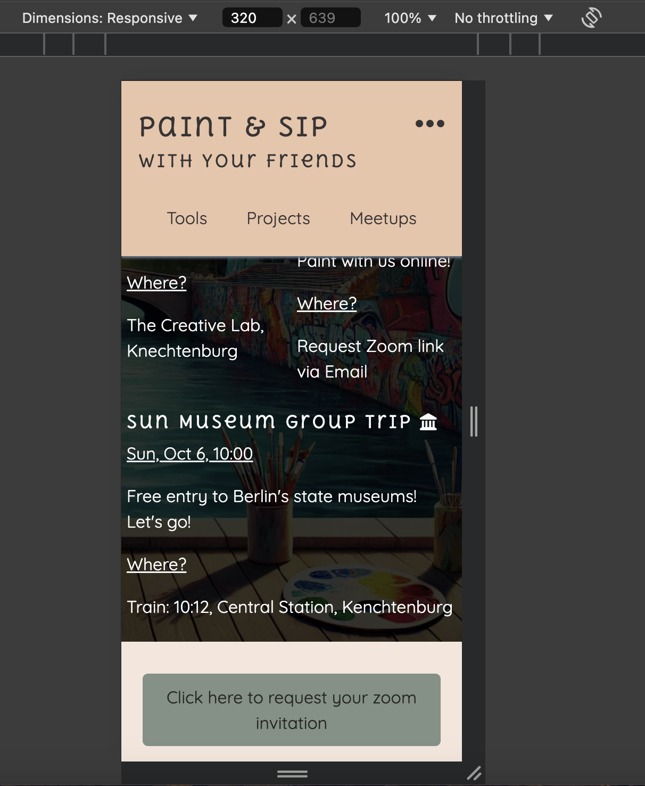</br>
    </details></br>

### Get in touch page 

+ A simple, user-friendly contact form with validation, built with regular HTML.

+ The contact form features a matching background image and a submit button, maintaining consistent styling with the rest of the website.

    <details>
    <summary>Contact Form of Get in touch page</summary>

    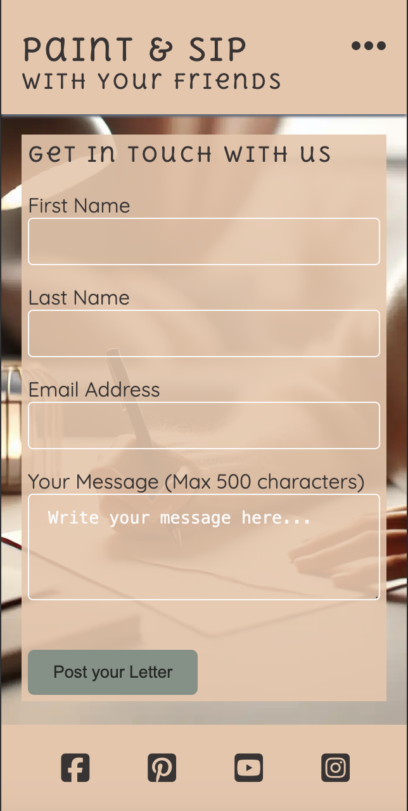</br>
    </details></br>

[Back to Table of Contents](https://github.com/nathiedeheyl/paint-and-sip-friends/blob/main/README.md#tabel-of-contents)

## Possible future features 

+ Convert 'blog.html' into an informational site. List most recent DIY projects and actual blog posts on informational site and create a new blog.html to which recent diy project and blog post cards on informational site link. Make new blog.html a page for more detailed visual and text content that the corresponding cards on infromational site link to. 

+ Add a comment section under each blog post for user engagement.

+ Develop a newsletter sign-up feature to keep users updated on new blog posts, events, and tips.

+ Implement user profiles to allow sharing of personal artwork and experiences.

+ Add a testimonials section for feedback from event participants.

+ Create a 'gallery' page where users can upload and showcase their artwork, allowing others to browse through creations.

+ Integrate social media sharing options for each blog post to increase outreach and visibility.

[Back to Table of Contents](https://github.com/nathiedeheyl/paint-and-sip-friends/blob/main/README.md#tabel-of-contents)

## Languages 

+ Mainly HTML, CSS

## Technologies 

+ Github for repository 
+ Gitpod IDE
+ Chrome Dev Tools 
+ Balsamiq for Wireframes 
+ Bootstrap for layout and components 
+ Google Fonts for typography 
+ Font Awesome for icons 
+ Imagify for image optimisation 
+ Page Speed Insights for accessibility requirements 
+ W3C for HTML code validation 
+ W3C for CSS code validation 

[Back to Table of Contents](https://github.com/nathiedeheyl/paint-and-sip-friends/blob/main/README.md#tabel-of-contents)

## Testing 

+ Throughout the workflow I have used the recommended [W3C HTML Validator](https://validator.w3.org) and [W3C Jigsaw CSS Validator](https://jigsaw.w3.org/css-validator/). 

+ Change in original header syntax, since I used h2 for styling purposes. Reverted this, made it an h1 with inline styling insted. 

### Manual testing checklist

| Category                 | Feature                                               | Result                                                                                  |
|--------------------------|-------------------------------------------------------|-----------------------------------------------------------------------------------------|
| **Feature Testing**       | Sticky Header                                         | Header stays at the top when scrolling.                                                  |
|                          | Toggle Menu                                           | Menu opens and closes when clicked on smaller devices, displaying a horizontal layout on larger screens. |
|                          | Jump Button                                           | Button scrolls to the corresponding section smoothly on mobile devices.                 |
|                          | Accordion in Blog Section                             | Accordion expands/collapses when clicked, displaying the content properly.               |
|                          | Call-to-Action Button (Meetups)                       | Button redirects users to the contact page.                                             |
| **Responsiveness Testing**| Sticky Header                                         | Header adjusts layout on larger screens and remains fixed on all device sizes when scrolling.                            |
|                          | Menu Flexbox Layout                                   | Menu layout switches from a vertical toggle on mobile to a horizontal layout on larger screens. |
|                          | Bootstrap Columns in Motivation Section               | Columns adjust for all screen sizes, ensuring a clean display on mobile, tablet, and desktop. |
|                          | Blog Section's Accordion                              | Accordion properly adjusts and doesn't overlap or distort on mobile devices.             |
|                          | Flexbox Layout in Meetups Section                     | Content in the section aligns properly in a compact display on smaller screens.          |
|                          | Contact Form Responsiveness                           | Contact form adjusts to all screen sizes, ensuring proper layout and usability on mobile, tablet, and desktop. |
| **Form Validation Testing**| Contact Form Validation                              | Validation triggers on form submission: email field requires an "@" sign, and all required fields must be filled. |
|                          | Contact Form Submit Button                            | On successful form submission, a new tab opens displaying the submitted text, indicating that the form works properly. |
| **Cross Browser Testing** | Chrome                                 | Website and features works as above                        |
|                          | Safari                                   | Website and features works as above                |
|                          | Opera                       | Website and features works as above |

### Bugs

+ After running the https://pagespeed.web.dev/ to access accessability I was prompted to make all links discernible; Research: (https://dequeuniversity.com/rules/axe/4.10/link-name); Added 'aria-labels' to all links, including anchor navigation links. 

+ Nav 'width: 100vh' caused toggled menu to have a max width of 648px. Fixed by adjusting 'width' to 100% instead. 

+ To center the bootstrap cards I had to contact turoring assistance eventually to find out about the "mx-auto" class which centered them on smaller devices below 768px. 

+ Removed margins of 'ul' in all headers to make it take up less space on tablets when hold horizontally. 

+ Used long version of background properties for contact form background image, because shorthand version wouldn't apply the image styling correctly. The long version ensured that the background was displayed properly across all screen sizes.

    ```
    #get-in-touch {
        background-image: url(../images/contact-form-background.webp);
        background-repeat: no-repeat;
        background-position: center center;
        background-size: cover;
    }
    ```

[Back to Table of Contents](https://github.com/nathiedeheyl/paint-and-sip-friends/blob/main/README.md#tabel-of-contents)

## Deployment 

The site was deployed to GitHub Pages. The steps to deploy are as follows:

- In the [GitHub repository](https://github.com/nathiedeheyl/paint-and-sip-friends), navigate to the Settings tab.
- Under the heading "Code and automation", select "Pages".
- From the Build and deployment section Branch drop-down menu, select the **Main** Branch and the /root folder, then click "Save".
- Refresh the page. Upon success you will be notified. 

[View the live site here](https://nathiedeheyl.github.io/paint-and-sip-friends)

## Credits

### Media

+ favicon: https://favicon.io/emoji-favicons/artist-palette 
+ Hero-image, Link Card images, Form Background Image created by [OpenAI](https://openai.com/) using DALL-E.* 
+ Weboptimizing images with Imagify: https://app.imagify.io/?status=success&utm_source=email_confirmation&utm_medium=email&utm_campaign=account_confirmation 
+ Menu and social media icons: https://fontawesome.com/search?q=instagram&o=r&m=free 
+ DIY Project cards: https://www.pinterest.de/ 

## Ressources 

Bootstrap: https://getbootstrap.com/docs/5.3/getting-started/introduction/

Code Institute's Submissions repository: https://github.com/Code-Institute-Submissions/

[Back to Table of Contents](https://github.com/nathiedeheyl/paint-and-sip-friends/blob/main/README.md#tabel-of-contents)

## Changelog 

### Version 1.0.0 (Initial)

+ Made header sticky instead of fixed to integrate it in document flow and remove margins on main content. 

+ Added a button .jump-btn to the hero section that when clicked jumps to the #about section, aimed at guiding mobile users to read all the content of the home page. 

+ Added an empty div between #about and #motivation for anchor navigation in an attempt to prevent to prevent the #about content from sliding under the sticky header that becomes fixed after scrolling. 

+ Added .jump-btn after #about section for the same purpose as above to jump to #motvation section. ~~Removed this button on larger screens to prevent irritation due to unnecessary nativation elements.~~ 

+ Bootstrap accordion instead of original idea of clickable buttons with collapsable text using bootstrap data-bs-parent="". 

+ add a call-to-action button after #meetups section that links to contact-form.html to guide reader to 'Get in Touch' page to contact site owner to obtain Zoom link invitation for virtual events.

+ Added a custom 404.html page with embedded css styling for the purpose of clarity. 

+ Since my main goal is "to inspire and engage users to start or continue painting as a hobby," and most of my target audience is likely to visit the website on a mobile device, I decided to change the layout of the Bootstrap cards in the #about section. I vertically stacked the cards to avoid overwhelming mobile users with too much content in the "Why Paint?" section. On desktop devices, having the cards in a row created an imbalance due to the differing content amounts. I imagine only my more engaged users, the "locals and virtuals," will likely visit the site on a larger screen to explore rather the DIY projects or engage with the blog and it's future features. Therefore, the home page layout is primarily optimized for mobile users.

+ Added a final `.intro-paragraph` style rule to format the content under the #Meetups heading. This class has been created for future use.

+ Removed .hidden-on-large after applying more margin to second jump-btn after #about section, creating more space on larger screens and recreating the necessity of a binding element. 

[Back to Table of Contents](https://github.com/nathiedeheyl/paint-and-sip-friends/blob/main/README.md#tabel-of-contents)